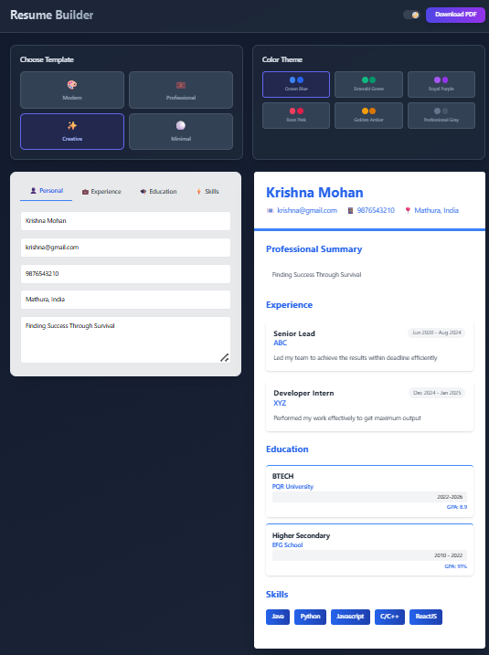

# 📄 ResumeBuilder Pro - Professional Resume Creator

  
  
  
  
  
  
  
  **Create stunning, ATS-friendly resumes in minutes with our modern resume builder**
  

## ✨ Features

### 🎨 Professional Templates
Choose from our carefully crafted templates designed to make your resume stand out:

 **🎨 Modern** - Clean, contemporary design with a creative touch
 **💼 Professional** - Classic layout perfect for corporate positions
 **✨ Creative** - Bold and unique design for creative professionals
 **⚪ Minimal** - Simple, elegant design that focuses on content

### 🎯 Color Themes
Personalize your resume with beautiful color schemes:

 **🌊 Ocean Blue** - Professional and trustworthy
 **🍀 Emerald Green** - Fresh and innovative
 **👑 Royal Purple** - Creative and sophisticated
 **🌹 Rose Pink** - Modern and approachable
 **🌟 Golden Amber** - Warm and confident
 **🔘 Professional Gray** - Classic and timeless

### 🌓 Dark Mode Support
 Seamless dark/light mode toggle
 Eye-friendly interface for extended use
 Consistent design across both themes
 Auto-detect system preference

### 📱 Core Features

#### Resume Building
- **Real-time Preview** - See changes instantly as you type
- **Multiple Resumes** - Create and manage multiple versions

#### Export Options
- **PDF Export** - High-quality PDF generation

## 🚀 Quick Start

### Prerequisites

Ensure you have the following installed:
- **Node.js** (v16.0.0 or higher)
- **npm** (v8.0.0 or higher) or **yarn**
- **Git**

### Installation

1. **Clone the repository**
   `
   git clone https://github.com/yourusername/resumebuilder-pro.git
   
   cd resumebuilder-pro
  

3. **Install dependencies**
   
   npm install
   # or
   yarn install
  

4. **Start the development server**
   
   npm start
   # or
   yarn start
  

5. **Open your browser**
   Navigate to [http://localhost:3000](http://localhost:3000)

## 🛠️ Tech Stack

### Frontend
- **[React.js](https://reactjs.org/)** - Component-based UI library
- **[Tailwind CSS](https://tailwindcss.com/)** - Utility-first CSS framework

### PDF Generation
- **[React PDF](https://react-pdf.io/)** - PDF generation

## 📱 Screenshots

## 🤝 Contributing

We welcome contributions! Please see our [Contributing Guide](CONTRIBUTING.md) for details.

1. Fork the Project
2. Create your Feature Branch (`git checkout -b feature/AmazingFeature`)
3. Commit your Changes (`git commit -m 'Add some AmazingFeature'`)
4. Push to the Branch (`git push origin feature/AmazingFeature`)
5. Open a Pull Request

## ⭐ Show your support

Give a ⭐️ if this project helped you!
